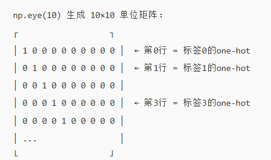
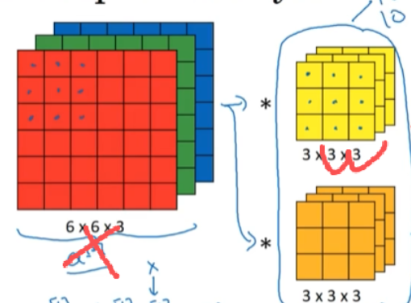
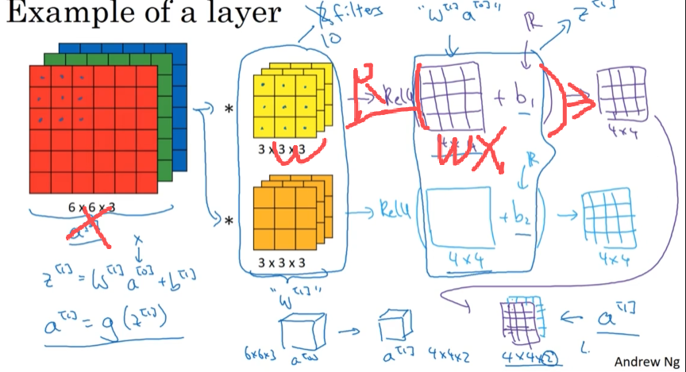
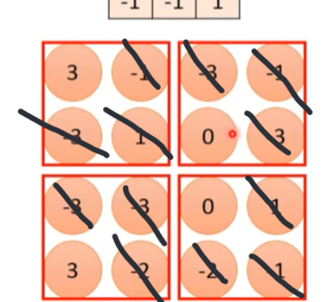
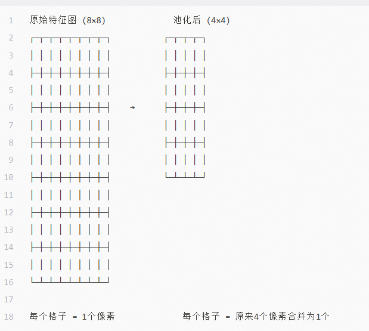
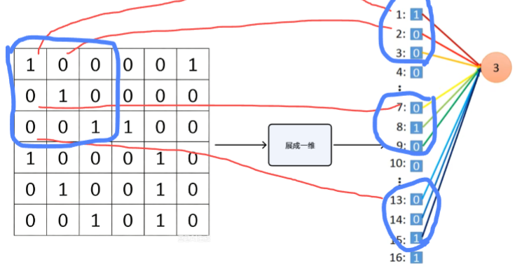
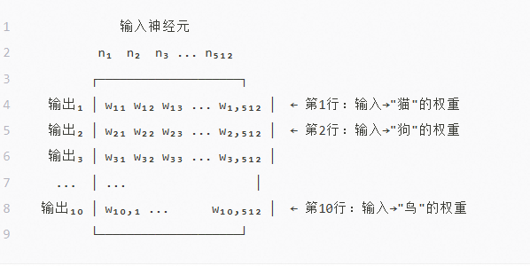
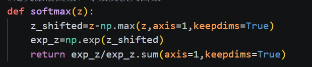

CNN 通过有监督训练学习图像的层次化视觉表征，以实现多分类任务。训练的评估标准是损失函数（通常为交叉熵），它衡量模型输出的概率分布与真实标签分布之间的差异。

# 数据获取与处理

- 从数据库下载/使用指定路径，获取数据。数据包含图片和标签，都是二进制，分训练集和测试集

- 将二进制图片使用numpy的功能处理，得到三维像素数组**(C，H, W)**（通道，高，宽）

- 再经维度变换与归一化，将三维像素数组转为 CNN 可处理的四维批次张量 (B, C, H, W)（每个批次样本数，通道数，高，宽），设为x,[因为CNN是一批一批图像处理，每批中的图片同时进行]

- 标签则从二进制解析为整数索引或One-Hot 向量。

  

# 卷积层

使用线性变换

卷积核相当于w

卷积的过程相当于w*x的过程

再对卷积后的结果加上一个偏置b

得到wx+b

# BatchNorm

因为一次处理一批，所以**BatchNorm**批数据进行求平均等多种方法得到最终具有代表性的数

# 激活层（用的ReLU激活函数）

接下来进入激活层

使用RELU激活函数，得到RELU(wx+b),即求得非线性特征

# 池化层

接着进入池化层，降低特征分辨率（让特征图的尺寸（高和宽）变小，使每个像素点"代表"更大范围的原始图像区域。）

# 展平层

再进入展平层将数组转为一维

# 全连接层

再到达全连接层映射回得分，每个输入神经元与每个输出神经元之间都有独立的权重，W 是权重矩阵，通过整向量矩阵乘法计算，也有偏置

# Softmax激活函数

最终将得分用softmax激活函数求出预测概率，return后面是softmax的表达式

# 损失函数

接着通过损失函数判断预测能力

如果预测效果不好

# 反向传播

梯度，复合函数求导

则反向传播逐层返回，重新调整w和b

而决定w和b如何调整是从损失函数出发，根据梯度下降趋势来判断，加以优化器来优化实现参数更新

整个过程由 **Dropout、数据增强、权重衰减、BatchNorm**等防止过拟合

# 啊！

计算过程！！！！！！那老多矩阵，求导

训练！！！！！一眼也没学咋写

超参数！！！！用哪个，还没想，怎么写，更没学

娘嘞
