# 0 学习目的

- 进行深度学习方面的实践，构建神经网络，超参数调整，正则化，诊断偏差，方差，高级优化算法

- 结构化机器学习工程

- 卷积神经网络，序列模型（RNN-LSTM），如何应用于自然语言处理（NLP）

# 1 二分类任务

二分类任务的目标是训练出来一个分类器

## 1.1 参数

图片特征向量的维度：


$$
n_x=size×通道数
$$


输入：


$$
x∈R^{n_x}
$$


输出：


$$
y∈(0，1)
$$


样本的表示：


$$
(x^i,y^i)
$$


训练样本集合的表示：


$$
D=\lbrace (x^{(1)},y^{(1)}),(x^{(2)},y^{(2)}),\ldots,(x^{(m)},y^{(m)}) \rbrace
$$


训练样本的个数(m)：


$$
m = m_{train}
$$


X的矩阵大小


$$
n_x×m
$$


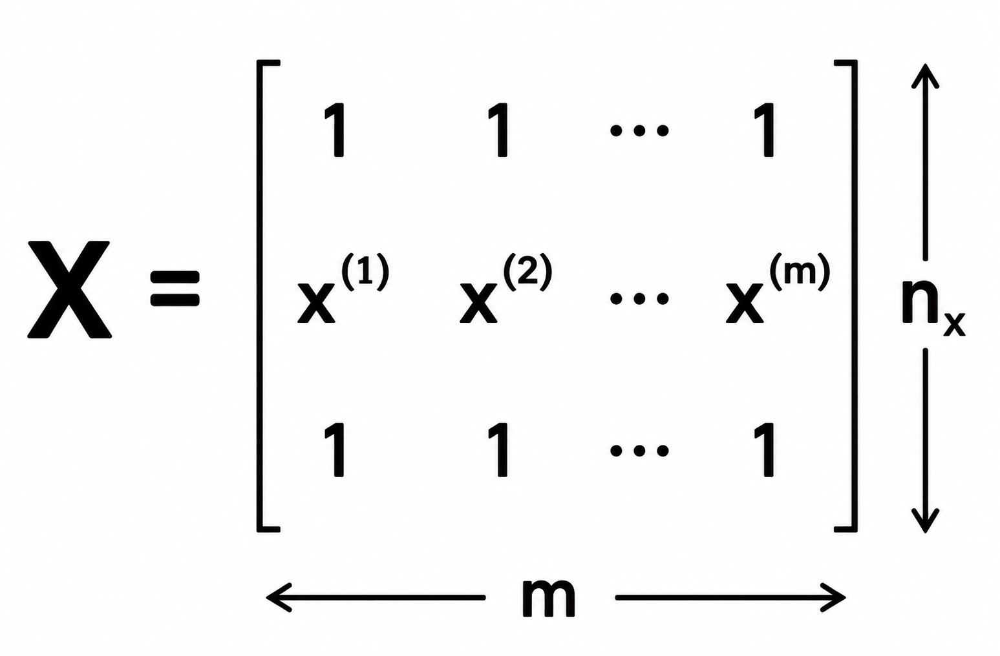


注：$X∈R^{n_x×m}$ 


Python命令：


$$
X.shape = (n_x,m)
$$


Y的矩阵大小为:


$$
1×m
$$


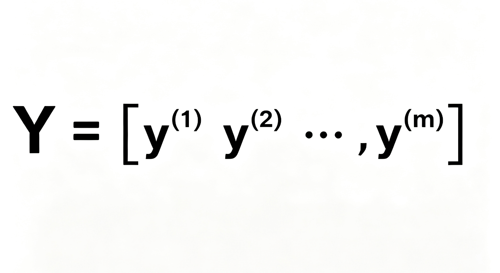

Python命令：


$$
Y.shape = (1,m)
$$


## 1.2 logistic回归算法

logistic是一个用于二分分类的算法  

预测值返回的一般不是布尔值，而是对正样本进行预测的可能性概率：


$$
\hat{y} = P(y=1|x),\hat{y}∈[0,1]
$$


Logistic回归的参数（parameters）是：


$$
w,w∈R^{n_x}  b,b∈R
$$


Output:


$$
\hat{y}=w^Tx+b
$$


### 1.2.1 激活函数（sigmoid函数）

为了实现预测值介于[0,1]范围内，我们使用激活函数（sigmoid函数）作用于该函数，即


$$
\hat{y}=\sigma（w^Tx+b）
$$


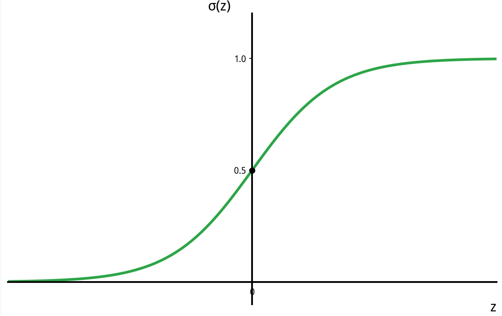

sigmoid函数：


$$
\sigma(z) = \frac{1}{1 + e^{-z}}
$$


即：


$$
\hat{y}=\frac{1}{1 + e^{-{（w^Tx+b）}}}
$$


### 1.2.2损失函数&成本函数

训练达到好的效果意味着损失函数和成本函数的值尽可能小

- 损失函数衡量的是单个训练样本上的表现

- 成本函数衡量的是全体训练样本上的表现

训练集的目的，是为了达到通过训练，调整参数w和b,使得预测结果接近实际结果（0/1）


$$
\hat{y}^{(i)}≈{y}^{(i)}
$$


损失函数（误差函数）[Loss(error) function]，起着与误差平方相似作用


$$
L(\hat{y},y)=\frac{1}{2}(\hat{y}-y)^2
$$


因为使用误差平方会使得梯度下降可能只能找到局部最优但找不到全局最优解

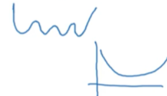

所以选择一种损失函数：


$$
L(\hat{y},y)=-（ylog\hat{y}+(1-y)log(1-\hat{y})）
\\
计算机中log默认是以e为底数的对数，即ln
$$


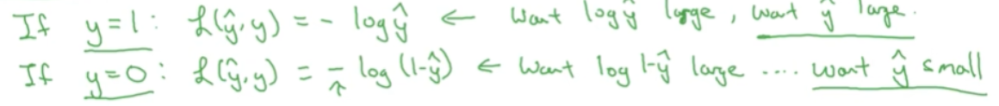

成本函数（Cost function）：


$$
J(w, b) = \frac{1}{m} \sum_{i=1}^{m} L(\hat{y}^{(i)}, y^{(i)}) = -\frac{1}{m} \sum_{i=1}^{m} \left[ y^{(i)} \log{\hat{y}^{(i)}} + (1 - y^{(i)}) \log{(1 - \hat{y}^{(i)})} \right]
$$


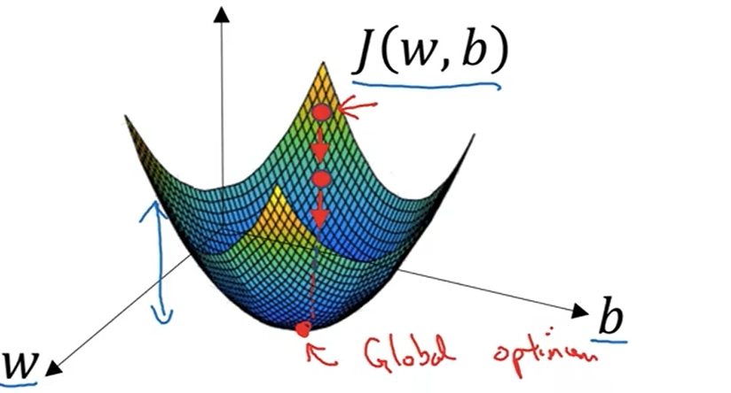

### 1.2.3梯度下降法

为达到成本函数 $J(w,b)$ 尽可能小的目的，由成本函数式中相关性得，要训练$ w,b$ 这两个变量（参数）

$ w,b$ 的更新（“：=”理解为赋值）


$$
w:w-\alpha\frac{\partial\:J(w,b)}{\partial\:w}
\\
b:b-\alpha\frac{\partial\:J(w,b)}{\partial\:b}
$$


具体训练过程以忽略b，为例:


$$
w:=w-\alpha\frac{d\:J(w)}{dw}
$$


- $\frac{d\:J(w)}{dw}$ 实则是对以变量为w的函数J(w)进行求导，导为线上点的斜率

- $\alpha:learning\:rate (lr)$ ,学习率,可以控制每一次或者迭代梯度下降法中的步长

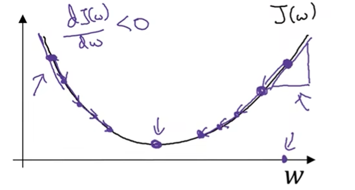

点的移动方向是向最终$j(w)$ 最小值移动的。斜率是标量，带正负号。

### 1.2.4反向传播

反向传播能够解释偏导数是如何计算的，进而能够实现logistic回归的梯度下降法

复合函数求偏导（红色）

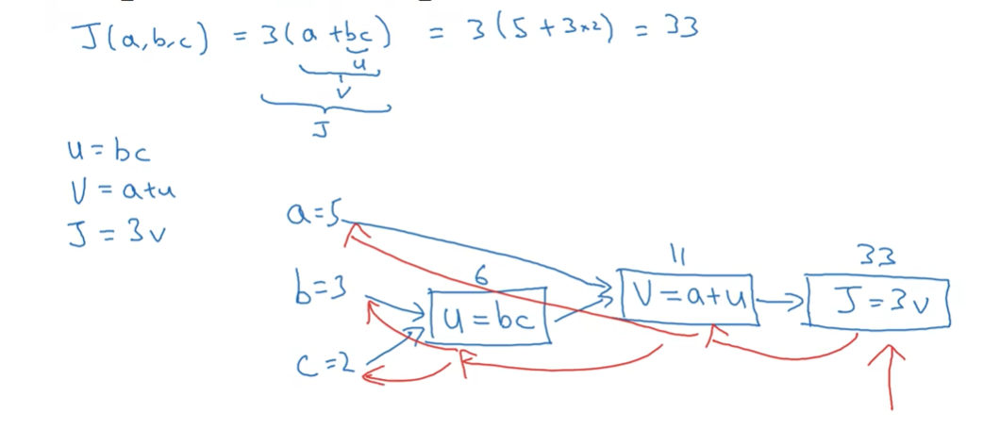

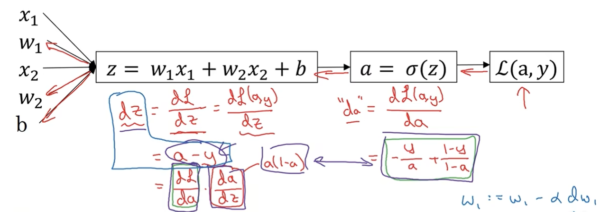

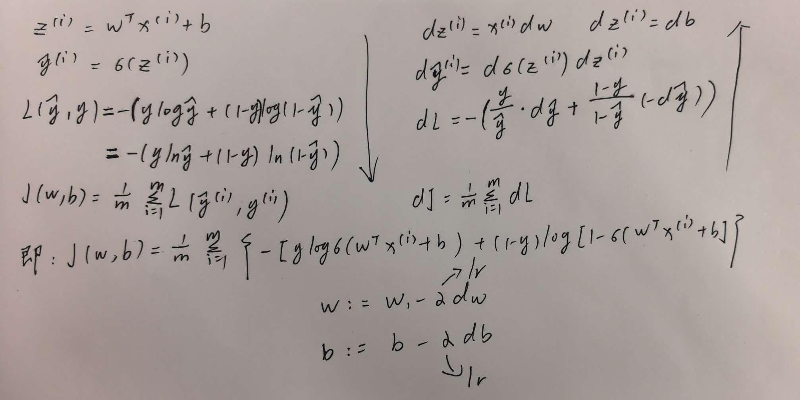

### 1.2.5向量化

向量化可以消除代码中的for循环，提高速度

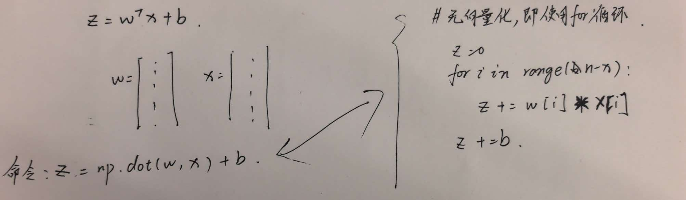

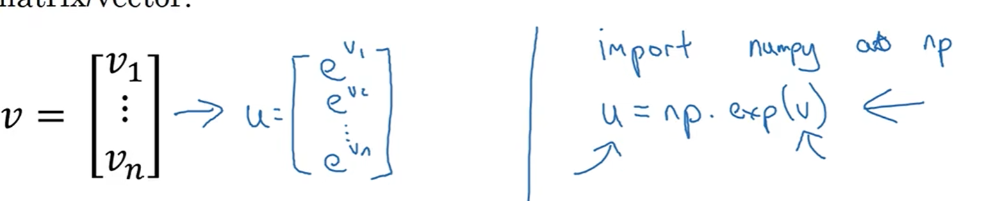

```
np.dot(a,b)#a矩阵*b矩阵
np.log()#计算log
np.abs()#计算绝对值
np.exp()#计算指数
np.maximum()#计算最大值
```

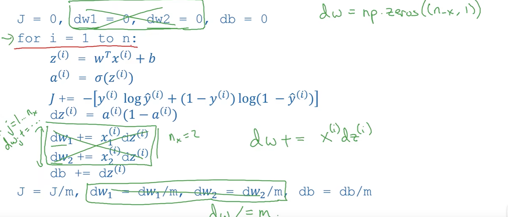

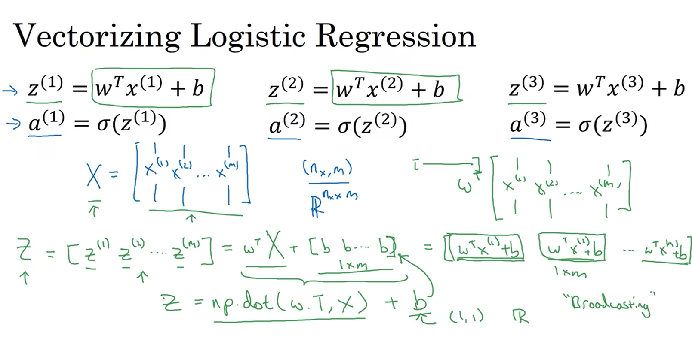
